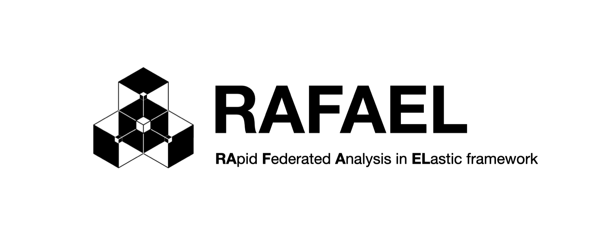

.. RApid Federated Analysis in ELastic Framework documentation master file, created by
   sphinx-quickstart on Wed Jun  5 09:51:18 2024.
   You can adapt this file completely to your liking, but it should at least
   contain the root `toctree` directive.

Welcome to **RA**\pid **F**\ederated **A**\nalysis in **EL**\astic Framework's (**RAFAEL**\) documentation!
=========================================================================
**RAFAEL** is a Python library aiming at implementing federated
algorithms easily with the well-designed interfaces.
Users can utilize this framework to build their own federated learning/analysis services.

.. toctree::
   :maxdepth: 2
   :caption: Contents:

Indices and tables
==================

* :ref:`genindex`
* :ref:`modindex`
* :ref:`search`
